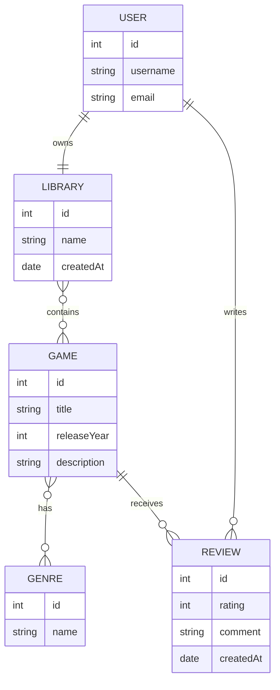

# ER-модель системи управління бібліотекою відеоігор

```mermaid
erDiagram
    USER ||--|| LIBRARY : owns
    LIBRARY }o--o{ GAME : contains
    GAME }o--o{ GENRE : has
    USER ||--o{ REVIEW : writes
    GAME ||--o{ REVIEW : receives

    USER {
        int id
        string username
        string email
    }

    LIBRARY {
        int id
        string name
        date createdAt
    }

    GAME {
        int id
        string title
        int releaseYear
        string description
    }

    GENRE {
        int id
        string name
    }

    REVIEW {
        int id
        int rating
        string comment
        date createdAt
    }
```
